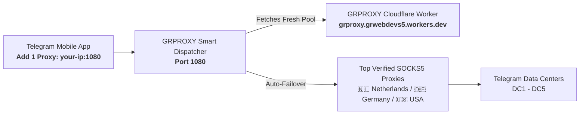

# GRPROXY — Single Permanent Proxy Dispatcher for Telegram

This dispatcher solves the common problem:
> **"I want to add only ONE permanent proxy in Telegram mobile, but have it automatically switch and rotate between fresh, verified proxies in the background whenever one fails."**

---

## How It Works



1. **You only add 1 proxy to Telegram**:
   - **Server**: Your computer/VPS IP (or `127.0.0.1` if running locally / Termux on Android)
   - **Port**: `1080`
   - **Type**: SOCKS5
   - **Username / Password**: *(leave empty)*
2. In the background, the dispatcher connects to your Cloudflare Worker (`https://grproxy.grwebdevs5.workers.dev/api/proxies?protocol=socks5`).
3. If an upstream proxy goes down or lags, the dispatcher **automatically hot-swaps** to the next healthy proxy in milliseconds without Telegram disconnecting!

---

## Quick Start (3 Ways to Run)

### Option 1: On Your Local Computer or Laptop
```bash
node relay/dispatcher.js
```
Then find your local IP (`ipconfig` on Windows or `ifconfig` on Mac/Linux) e.g. `192.168.1.50`.
In Telegram mobile on the same Wi-Fi:
* Server: `192.168.1.50`
* Port: `1080`

### Option 2: On a Cloud VPS (Render / Railway / Fly.io / Oracle Free Tier / DigitalOcean)
```bash
docker build -t grproxy-dispatcher .
docker run -d -p 1080:1080 --name grproxy-dispatcher grproxy-dispatcher
```
Then in Telegram Mobile on any network (Wi-Fi or Mobile Data 4G/5G):
* Server: `YOUR_VPS_PUBLIC_IP`
* Port: `1080`

### Option 3: Directly on Android Mobile (Using Termux - No PC or Server Needed)
1. Install [Termux](https://f-droid.org/packages/com.termux/) on Android.
2. Run:
```bash
pkg install nodejs git -y
git clone https://github.com/grwebdevs/grproxy.git
cd grproxy/relay
node dispatcher.js
```
3. In Telegram App on the same phone:
   * Server: `127.0.0.1`
   * Port: `1080`
* You now have an auto-rotating permanent proxy running 100% on your own mobile device!
